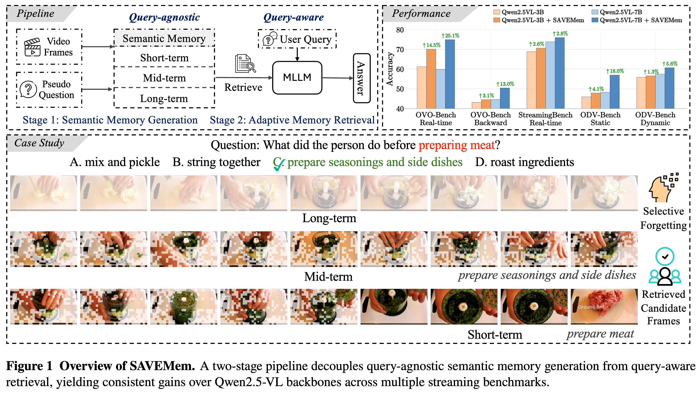
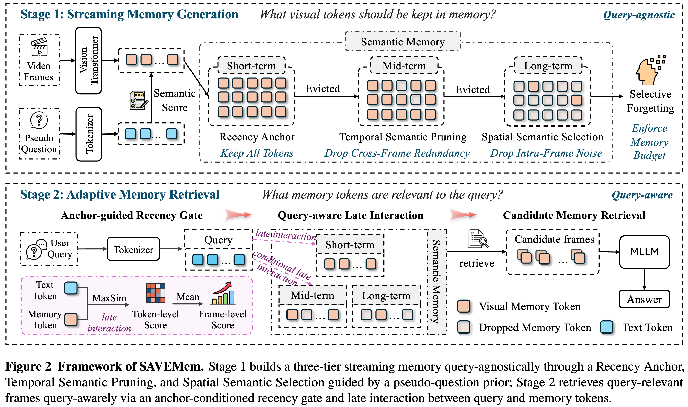
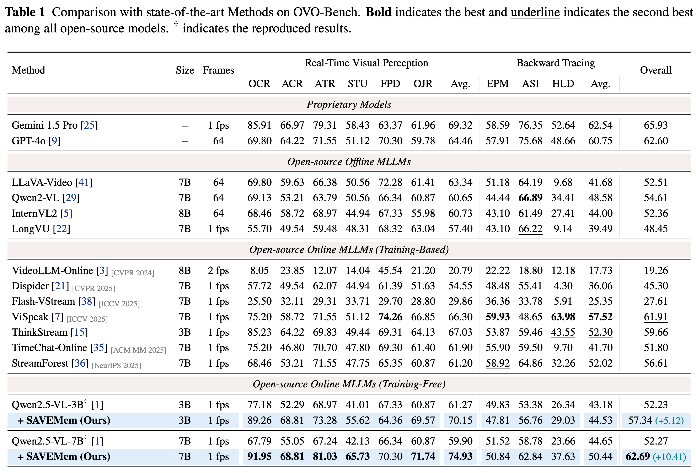

<p align="center" width="100%">
<!-- <a target="_blank"></a>
</p> -->

<div align="center">

# Semantic-Aware Adaptive Visual Memory for Streaming Video Understanding

</div>


<div align="center">
    
</div>


<div align="center">
<div class="is-size-5 publication-authors" style="font-size: 18px;">
    <span class="author-block">
      <a href="https://wuhang03.github.io/" target="_blank">Hang Wu</a><sup>1</sup>
    </span>
    &nbsp;&nbsp;&nbsp;&nbsp;
    <span class="author-block">
      <a href="https://scholar.google.com/citations?user=g6ZUSO8AAAAJ&hl=en" target="_blank">Sherin Mary Mathews</a><sup>2</sup>
    </span>
    &nbsp;&nbsp;&nbsp;&nbsp;
    <span class="author-block">
      <a href="https://vanoracai.github.io/" target="_blank">Yujun Cai</a><sup>3†</sup>
    </span>
    <br>
    <span class="author-block">
      <a href="https://faculty.ucmerced.edu/mhyang/" target="_blank">Ming-Hsuan Yang</a><sup>1</sup>
    </span>
    &nbsp;&nbsp;&nbsp;&nbsp;
    <span class="author-block">
      <a href="https://wangywust.github.io/" target="_blank"> Yiwei Wang</a><sup>1</sup>
    </span>
  </div>


  <br>
  <div class="is-size-5 publication-authors" style="font-size: 18px;">
    <span class="author-block">
      <sup>1</sup>University of California, Merced
      &nbsp;&nbsp;&nbsp;&nbsp;&nbsp;&nbsp;
      <sup>2</sup>US Bank
      &nbsp;&nbsp;&nbsp;&nbsp;&nbsp;&nbsp;
      <sup>3</sup>The University of Queensland
    </span>
    <span class="eql-cntrb"><small><br><sup>†</sup>Indicates Corresponding Author</small></span>
  </div>
</div>


<div style='display: flex; gap: 0.45rem; justify-content: center; text-align: center;' align="center">
  <a href='https://arxiv.org/abs/2605.07897'></a>
  <a href='LICENCE'></a>
</div>


## 🔥 Update
<!-- * [2024-04-05]: ⭐️⭐️⭐️ VCD is selected as Poster Highlight in CVPR 2024! (Top 11.9% in accepted papers)
* [2023-11-29]: ⭐️ Paper of VCD online. Check out [this link](https://arxiv.org/abs/2311.16922) for details. -->


* [2026-05-07]: 🚀 Codes released.

## 🎯 Overview
<div align="center">
    
</div>

Abstract: Online streaming video understanding requires models to process continuous visual inputs and respond to user queries in real time, where the unbounded stream and unpredictable query timing turn memory management into a central challenge. Existing methods typically compress visual tokens via visual similarity heuristics, or augment compression with KV-cache-level retrieval. However, compression decisions rarely incorporate semantic signals, and retrieval is often added after compression is finalized, making the two stages hard to coordinate. We present **SAVEMem**, a training-free dual-stage framework that brings semantic awareness into memory generation and lets the retrieval scope adapt per query. In Stage 1, SAVEMem builds a three-tier streaming memory online under a constant memory budget. A fixed pseudo-question bank provides a lightweight semantic prior, so that long-term retention is shaped by semantic salience rather than visual similarity alone. In Stage 2, SAVEMem performs query-aware retrieval over this memory. An anchor-conditioned recency gate adapts the retrieval scope from short-term to mid- and long-term memory based on whether the query targets the present or the distant past. Within this scope, late interaction between query and memory tokens selects candidate frames for answering. Applied to Qwen2.5-VL without training, SAVEMem improves the OVO-Bench overall score from 52.27 to 62.69 and yields consistent gains on StreamingBench and ODV-Bench, while reducing peak GPU memory by 48% at 128 frames over the backbone.


## ⚙️ Framework

<div align="center">
    
</div>


## 🕹️ Usage

### Data Preparation

The data download scripts are in [data.sh](data.sh). Note that these datasets are very large, you may want to try downloading them once at a time if you have limited storage on your platform.

```bash
hf download JoeLeelyf/OVO-Bench --repo-type dataset --local-dir ./ovo
python unzip_ovo.py

hf download mjuicem/StreamingBench --repo-type dataset --local-dir ./StreamingBench
python unzip_streaming.py

hf download MCG-NJU/ODV-Bench --repo-type dataset --local-dir ./odv
python unzip_odv.py
```

We use three different benchmarks in this project, you can refer to [OVO-Bench](https://github.com/joeleelyf/ovo-bench), [StreamingBench](https://github.com/thunlp-mt/streamingbench) and [ODV-Bench](https://github.com/MCG-NJU/StreamForest) for further details.

### Environment Setup

We use uv to manage packages in this project, the scripts are in [setup.sh](setup.sh). You can directly run the setup scripts or run following commands, if you want to do some modifications to the environment.

```bash
uv venv --python=python3.11
source .venv/bin/activate

uv pip install -e models/qwen2-5-vl
uv pip install -e models/qwen-vl-utils

uv pip install ffmpeg-python==0.2.0 moviepy==1.0.3   # for StreamingBench / OVO-Bench

uv pip install torch==2.8.0 torchvision==0.23.0
uv pip install transformers==4.49
uv pip install flash_attn --no-build-isolation

uv pip install decord==0.6.0
```


### Evaluation

The evaluation scripts for three different benchmarks are in [evaluation](evaluation/) folder, you can run the scripts in each folder to reproduce experimental results reported in our paper.

```bash
bash evaluation/ovobench/ovobench.sh
bash evaluation/streamingbench/streamingbench.sh
bash evaluation/odvbench/odvbench.sh
```

Core codes of our proposed SAVEMem is in [savemem.py](models/qwen2-5-vl/src/qwen2_5_vl_savemem/savemem.py).

## 📊 Experimental Results


<div align="center">
    
</div>


## 📑 Citation
If you find our project useful, we hope you can star our repo and cite our paper as follows:
```
@article{wu2026semantic,
  title={Semantic-Aware Adaptive Visual Memory for Streaming Video Understanding},
  author={Wu, Hang and Mathews, Sherin Mary and Cai, Yujun and Yang, Ming-Hsuan and Wang, Yiwei},
  journal={arXiv preprint arXiv:2605.07897},
  year={2026}
}
```

## 📝 Acknowledgements

We sincerely appreciate the contributions of the open-source community. The related projects are as follows: 
* Framework: [FluxMem](https://github.com/YiwengXie/FluxMem), [Qwen2.5-VL](https://github.com/QwenLM/Qwen-VL)
* Evaluation: [OVO-Bench](https://github.com/joeleelyf/ovo-bench), [StreamingBench](https://github.com/thunlp-mt/streamingbench) and [ODV-Bench](https://github.com/MCG-NJU/StreamForest)


## License

This project is licensed under the terms of the Apache License 2.0.
You are free to use, modify, and distribute this software under the conditions of the license.
This project is intended for academic and research purposes only. Any commercial use is strictly prohibited without prior written consent.


